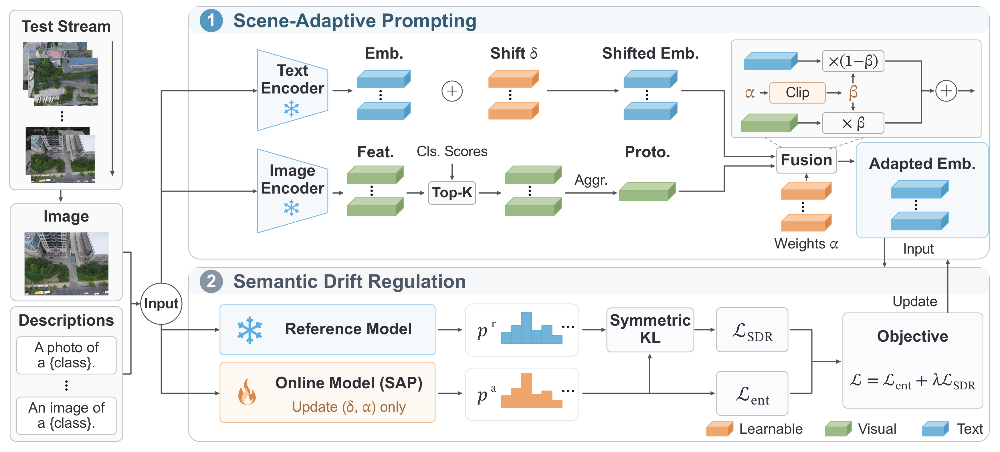

<h1 align="center">
  Scene-Adaptive Continual Test-Time Adaptation for Open-Vocabulary Remote Sensing Segmentation
</h1>

<h2 align="center">
  🌟 ICASSP 2027 Submission 🌟
</h2>

  

## Abstract

> Open-vocabulary remote sensing image semantic segmentation (OVRSIS) enables pixel-level recognition of text-defined categories with vision-language models, but existing methods are mostly evaluated under static test distributions or episodic adaptation protocols. In real deployments, sensor noise, imaging conditions, and environmental changes induce continual distribution shifts, where unsupervised online optimization can accumulate prediction drift and degrade performance. We propose **SCTA**, a Scene-Adaptive Continual Test-Time Adaptation framework for OVRSIS. It contains two complementary modules: **Scene-Adaptive Prompting (SAP)** builds category-level visual prototypes from frozen multi-description predictions and injects scene-relevant visual evidence into text representations, while **Semantic Drift Regulation (SDR)** constrains online predictions against a frozen reference model with symmetric KL divergence. The adaptation updates only text embedding offsets and fusion parameters, keeping the visual encoder frozen. On continual test streams constructed from seven remote sensing datasets, each with 15 corruption domains, **SCTA** achieves an average mIoU of **31.24%**, improving over the source model by **5.79 percentage points** and the strongest continual adaptation baseline, CoTTA, by **7.19 percentage points**. Ablation studies show that **SDR** stabilizes continual adaptation and **SAP** further improves segmentation quality. Code will be released at [https://github.com/semondawn9/SCTA](https://github.com/semondawn9/SCTA).

## Results

Continual test-time adaptation performance (mIoU, %):

| Dataset | SAR | TENT | CoTTA | MLMP | TMPA | DAF | SCTA |
|:---:|---:|---:|---:|---:|---:|---:|---:|
| OpenEarthMap | 15.99 | 3.17 | 11.95 | 2.11 | 2.71 | 17.73 | **22.45** |
| DeepGlobe | 36.69 | 47.90 | 51.98 | 47.89 | 47.87 | 29.88 | **53.23** |
| LoveDA | 14.99 | 5.17 | 16.73 | 5.17 | 5.20 | 20.58 | **20.70** |
| UAVid | 22.00 | 4.76 | 21.26 | 3.61 | 3.34 | 22.04 | **29.46** |

## Qualitative Results

  

