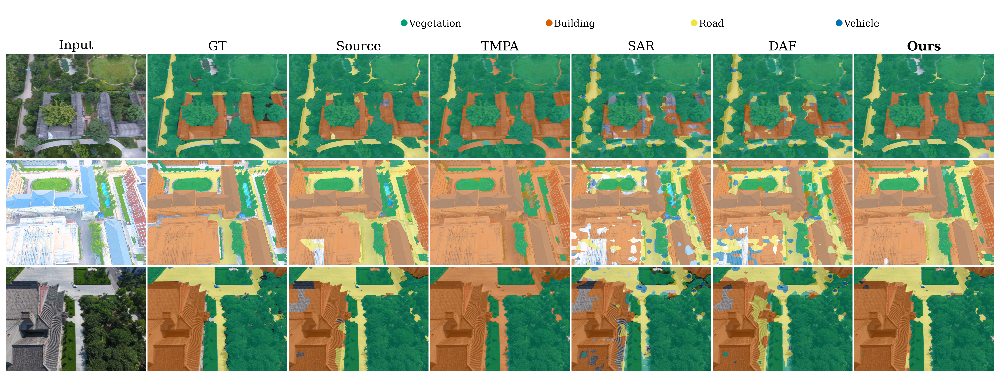

# SCTA

**SCENE-ADAPTIVE CONTINUAL TEST-TIME ADAPTATION FOR OPEN-VOCABULARY REMOTE SENSING SEGMENTATION**

## Abstract

Open-vocabulary remote sensing image segmentation (OVRSIS) enables flexible semantic understanding with vision-language models. However, existing methods usually rely on static inference or episodic adaptation, making them vulnerable to continuous distribution shifts in real-world test streams. We propose **SCTA**, a scene-adaptive continual test-time adaptation framework for open-vocabulary remote sensing segmentation.

SCTA introduces two key components: **Scene-Adaptive Prompting (SAP)**, which dynamically adapts textual representations with scene-aware visual guidance, and **Semantic Drift Regulation (SDR)**, which preserves semantic consistency during continual adaptation through a reference-guided optimization objective. Together, SCTA improves adaptation stability while maintaining open-vocabulary segmentation capability under continuous corruptions.

## Method

  <a href="assets/method_v13.ppng">Method Figure (PDF)</a>

## Main Results

| Dataset | SAR | TENT | CoTTA | MLMP | TMPA | DAF | SCTA |
|:---:|:---:|:---:|:---:|:---:|:---:|:---:|:---:|
| OpenEarthMap | 15.99 | 3.17 | 11.95 | 2.11 | 2.71 | 17.73 | **22.45** |
| DeepGlobe | 36.69 | 47.90 | 51.98 | 47.89 | 47.87 | 29.88 | **53.23** |
| LoveDA | 14.99 | 5.17 | 16.73 | 5.17 | 5.20 | 20.58 | **20.70** |
| UAVid | 22.00 | 4.76 | 21.26 | 3.61 | 3.34 | 22.04 | **29.46** |

## Qualitative Results

  

